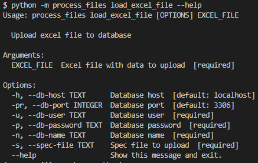
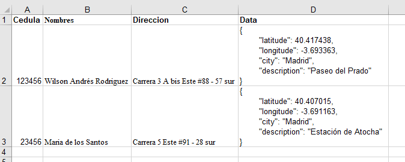
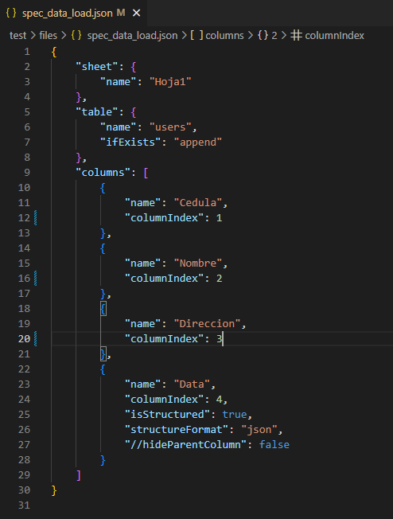
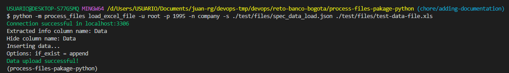
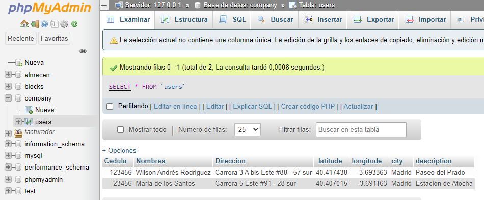

# Process files ⚙

Este es un paquete simple que le brinda funcionalidad a través de un cli para procesar y cargar archivos a una base de datos.

## Funcionalidades habilitadas
* Cargar un archivo de excel a una base de datos mediante [CLI](https://es.wikipedia.org/wiki/Interfaz_de_l%C3%ADnea_de_comandos)
* Base de datos permitidas: __postgresql__, __mysql__, __sqlserver__
* Archivo de especificaciones en formato __json__ para especificar la carga de la informacion.

## Requerimientos

* python version = [3.10](https://www.python.org/ftp/python/3.10.5/python-3.10.5-amd64.exe)
* gestor de dependencias de python [pipenv](https://pypi.org/project/pipenv/)
* Docker para levantar una base de datos de prueba

## Instalación (Windows)
Ejecutar los siguientes comandos desde la base root del proyecto.

Crear entorno virtual e instslar dependecias:
```
pipenv install --ignore-pipfile
```

Visualizar las rutas del entorno virtual:
```
pipenv --venv
```

Establecer entorno virtual para ejecutar comandos:
```
source /path_virtual_env/Scripts/activate
```

Instalar la base de datos dockerizada.
Opcional: puede cambiar las credenciales de la base de datos editando el archivo __./scripts/docker/build_and_run_mysql.sh__ linea: 5
```
sh ./scripts/docker/build_and_run_mysql.sh
```

## Comandos CLI

* ### Cargar un archivo de excel:
  comando: ```load_excel_file```, ejemplo:
  ```
  python -m process_files load_excel_file -u root -p secret -n company -s ./test/files/spec_data_load.json ./test/files/test-data-file.xls
  ```
  Opciones:

  

## Archivo de especificaciones

Este archivo se utiliza para especificar opciones sobre como cargar la data y se escribe en formato __json__
Estructura:
```javascript
{
    "sheet": {
        "name": {
            "description": "Nombre de la hoja del libro excel con la data a cargar."
            "requerido": true
            "example": "Sheet1"
        }
    },
    "table": {
        "name": {
            "description": "Nombre de la tabla en base de datos donde se cargará la información."
            "requerido": true
            "example": "users"
        },
        "ifExists": {
            "description": "Metodo para cargar la informacion, opciones: fail, replace, append."
            "requerido": false
            "example": "append"
        }
    },
    "columns": [
        {
            "name": {
                "description": "Nombre de la columna en el libro de excel."
                "requerido": true
                "example": "Address"
            },
            "columnIndex": {
                "description": "Indice de la posicion de la hoja en el excel."
                "requerido": true
                "example": 1
            },
            "isStructured": {
                "description": "Indica si la columna tiene data estructurada para extraer, formato aceptados json. Por default es false"
                "requerido": false
                "example": true
            },
            "hideParentColumn": {
                "description": "Permite ocultar la columna en la carga del excel."
                "requerido": false
                "example": true
            }
        }
    ]
}
```


## Ejemplo de ejecucion y salida

Valide la existencia del archivo __./test/files/test-data-file.xls__ el cual contiene la data a cargar:


Valide la existencia del archivo __./test/files/spec_data_load.json__ el cual contiene las especificaciones de cargar:


Ejecutar el siguiente comando (Recuerde establecer entorno virtual para ejecutar comandos):
```
python -m process_files load_excel_file -u root -p supersecret -n company -s ./test/files/spec_data_load.json ./test/files/test-data-file.xls
```

Salida en consola:


Salida en base de datos:



---
Autor:  **Juan Rodriguez** - _Developer_ - [juparog](https://github.com/juparog).
